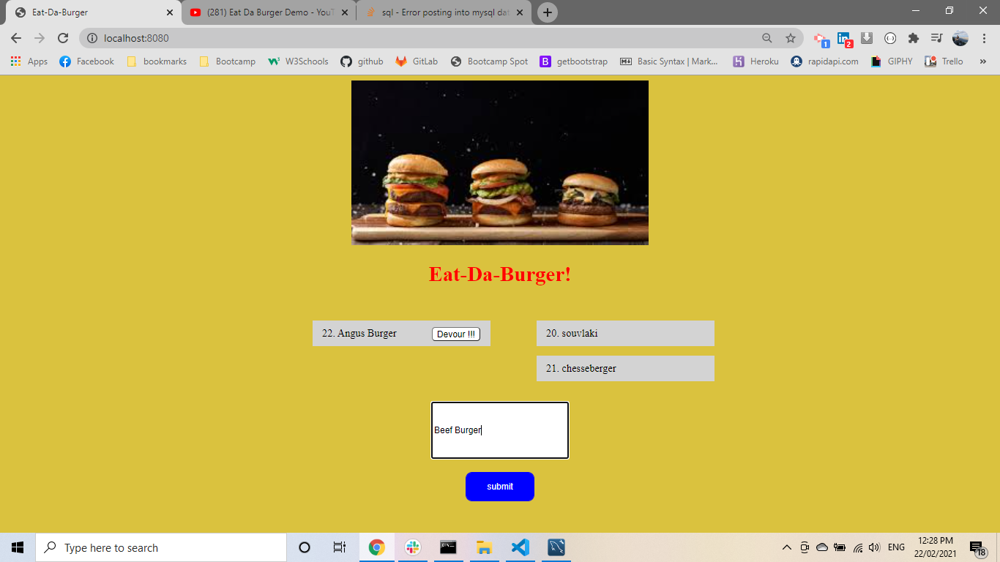
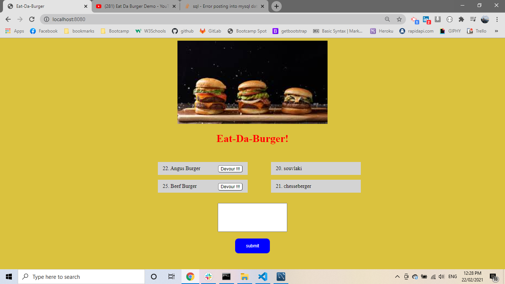
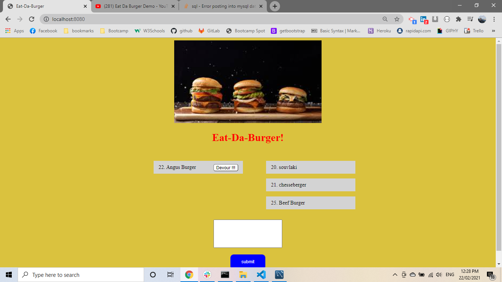

# burger

* [links](#links)
* [Installation](#installation)
* [ Descriptione](#description)
* [Tests](#tests)
* [Questions](#questions)

## links

    link of the repository :   https://github.com/pfotis/burger

    link of the webpage  :  

## Description

    This application could help the user to store burgers. And the user could see in his/her
    screen the list of the burgers the user can see for each burger created a button "devour"
    as soon as click this butoon for any burger the burger move to right side of the screen.

    At this application we use database to store and restore  and update the data (burgers),
    the user could see at his/her screen.

## Installation

    npm install express

    npm install express-handlebars

    npm install mysql

    npm install nodemon

    npm install watch

    npm init

## Test

    With the following pictures the user could see the outfit of this project.

## Questions

    Questions about this repository? Please contact me at pfotis@gmail.com.
    View my work in GitHub pfotis(https://github.com/pfotis).